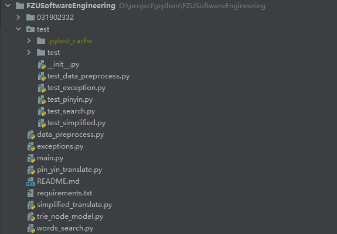
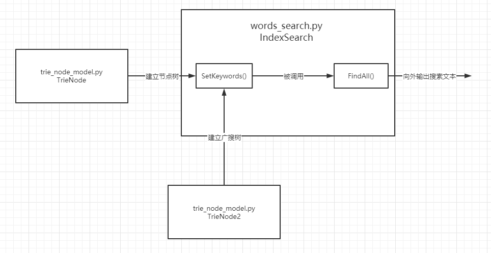
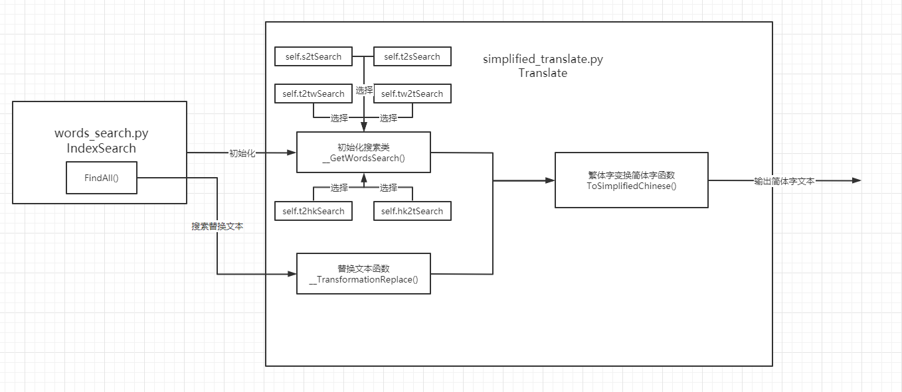
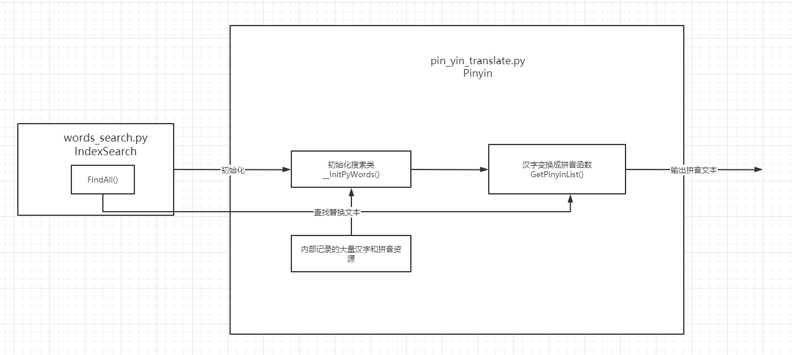
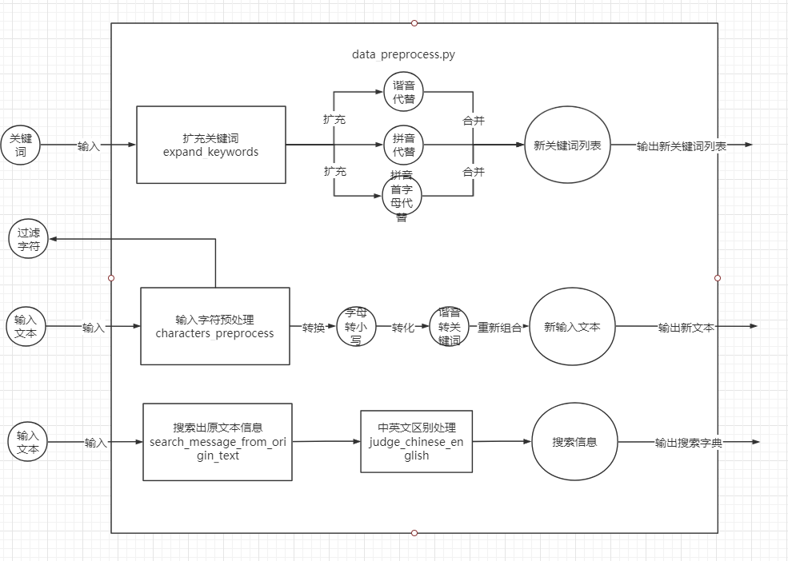
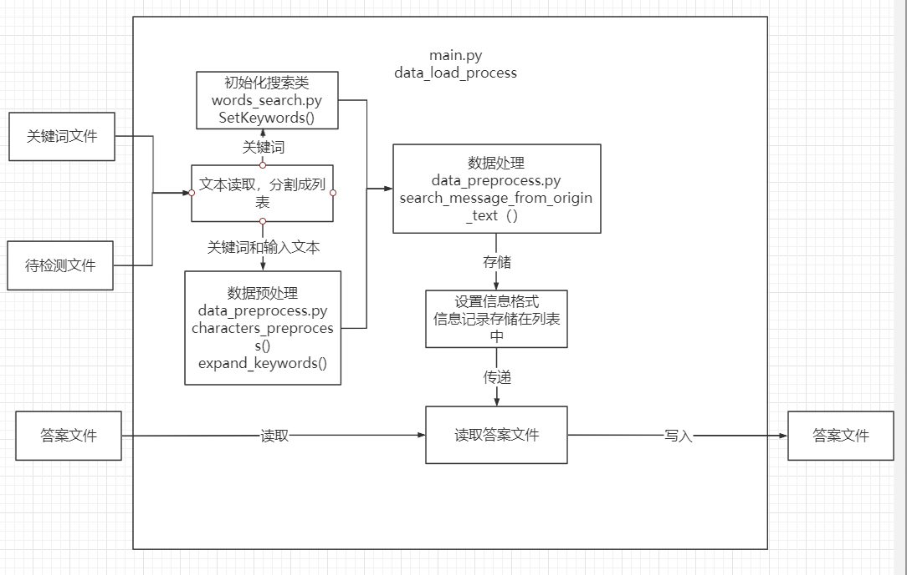
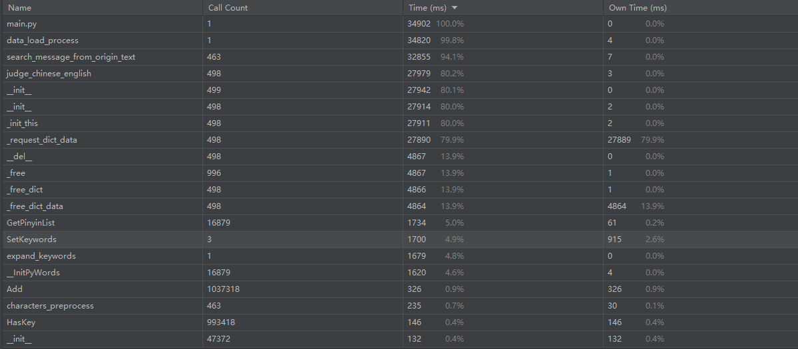
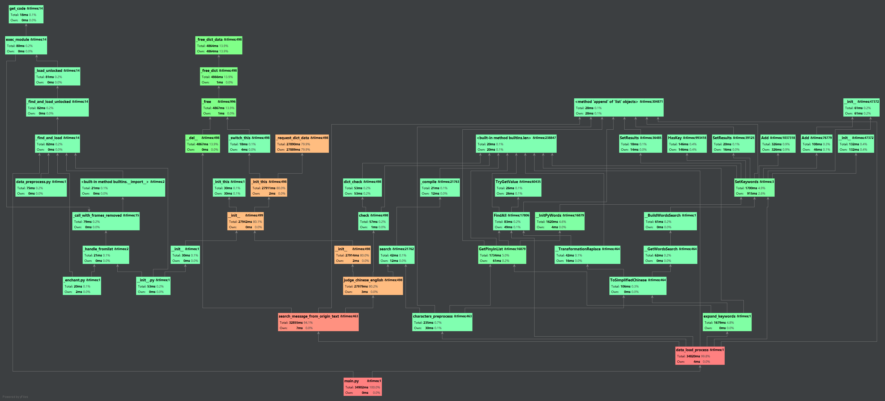

https://github.com/trainKing-star/FZUSoftwareEngineering

# 一、PSP表格

| **PSP2.1**                              | **Personal Software Process Stages**    | **预估耗时（分钟）** | **实际耗时（分钟）** |
| --------------------------------------- | --------------------------------------- | -------------------- | -------------------- |
| Planning                                | 计划                                    | 10                   | 10                   |
| · Estimate                              | · 估计这个任务需要多少时间              | 10                   | 10                   |
| Development                             | 开发                                    | 1180                 | 945                  |
| · Analysis                              | · 需求分析 (包括学习新技术)             | 360                  | 200                  |
| · Design Spec                           | · 生成设计文档                          | 20                   | 30                   |
| · Design Review                         | · 设计复审                              | 10                   | 10                   |
| · Coding Standard                       | · 代码规范 (为目前的开发制定合适的规范) | 10                   | 15                   |
| · Design                                | · 具体设计                              | 60                   | 70                   |
| · Coding                                | · 具体编码                              | 600                  | 500                  |
| · Code Review                           | · 代码复审                              | 60                   | 70                   |
| · Test                                  | · 测试（自我测试，修改代码，提交修改）  | 60                   | 50                   |
| Reporting                               | 报告                                    | 100                  | 120                  |
| · Test Repor                            | · 测试报告                              | 60                   | 80                   |
| · Size Measurement                      | · 计算工作量                            | 10                   | 10                   |
| · Postmortem & Process Improvement Plan | · 事后总结, 并提出过程改进计划          | 30                   | 30                   |
|                                         | · 合计                                  | 1290                 | 1075                 |

# 二、计算模块接口

## 1. 计算模块接口的设计与实现过程

项目中包括以下几个部分：

- trie_node_model.py——树节点模型模块，有TrieNode树节点类、TrieNode2广搜节点类，用于建立后续关键词算法模型，包含敏感词、拼音、繁简体字等模型
  - TrieNode——树节点类，记录节点索引、所在树层、字符代表的十进制整数、子节点列表、对应的关键词等信息
  - TrieNode2——广搜节点类，记录周围可到达的节点列表、节点列表中字符十进制树的最大值和最小值、节点对应的关键词等信息

- words_search.py——广搜算法实现模块，有一个IndexSearch搜索类
  - IndexSearch搜索类，类中最主要的有两个方法SetKeywords()和FindAll()
    - SetKeywords()方法，将输入的关键词列表转化为树结构，再将整棵树转化为广搜树
    - FindAll()方法，通过SetKeywords()方法生成的广搜树，快速查找文本中对应的敏感词节点
- simplified_translate.py——繁简体字转换模块，有一个Translate繁简体字转换类
  - Translate繁简体字转换类，最主要的方法是ToSimplifiedChines()，通过类中已经记录的大量繁简体字，使用IndexSearch搜索类生成简体广搜树，将繁体文本转化为简体文本
- pin_yin_translate.py——汉字拼音转换模块，有一个Pinyin汉字拼音转换类
  - Pinyin汉字拼音转换类，核心方法是GetPinyinList()，通过类中已经记录的大量汉字拼音对应字符，使用IndexSearch搜索类生成拼音广搜树，将汉字文本转化为拼音文本
- data_preprocess.py——数据预处理模块，拥有扩充关键词、输入文本预处理、中英文区别判断、敏感词搜索处理功能
  - expand_keywords()——扩充关键词函数：包括扩充谐音替代、拼音替代、拼音首字母代替
  - characters_preprocess()——输入文本预处理函数：将输入文本中字母转化为小写，删除所有字母、汉字、换行符以外的字符，将文本中与关键词中字谐音的字转化为与该字谐音的关键字
  - judge_chinese_english()——中英文区别判断函数：根据搜索的文本段是英文还是中文返回不同的信息
  - search_message_from_origin_text()——敏感词搜索处理函数：从原输入文本中搜索查找到的敏感词信息，选择同开始索引但结束索引更大的敏感词文本输出
- exceptions.py——异常处理模型，记录了一些项目中的自定义异常处理类，有一个自定义的文件处理异常类FileProcessException
  - FileProcessException类，，用于进行输入路径是否存在以及输入路径是否为文件等判断
- main.py——主执行模块，有一个函数data_load_process()
  - data_load_process()，负责加载数据、调用其他模块处理数据、将处理结果写入文件
- test——单元测试包，里面包含了五个测试模块，进行对上述几个模块中大部分函数的单元测试
  - test_simplified.py——测试繁简体模块
  - test_search.py——测试搜索类模块
  - test_pinyin.py——测试汉字拼音转换模块
  - test_exception.py——测试自定义异常处理模块
  - test_data_preprocess.py——测试数据预处理以及主执行模型

### （1）words_search.py——广搜算法实现模块

words_search.py是整个项目的核心模块，每一个模块都会用到这个模块的IndexSearch搜索类，这个类中搜索算法是使用的广搜算法

### （2）simplified_translate.py——繁简体字转换模块

simplified_translate.py模块中的Translate类，对外提供的函数是ToSimplifiedChinese()，内部通过__GetWordsSearch()类选择使用哪种内部资源初始化IndexSearch搜索类，再通过TransformationReplace()方法搜索简体文本并完成替换，最后由ToSimplifiedChinese()方法输出简体字文本

### （3） pin_yin_translate.py 汉字拼音转换模块

与simplified_translate.py类似，pin_yin_translate.py 结合内部资源初始化IndexSearch类，由核心方法GetPinyinList()去调用搜索拼音和替换文本，最后输出处理好的拼音文本

### （4）data_preprocess.py——数据预处理模块

如图所示，expand_keywords()函数将扩充敏感词包括扩充谐音替代、拼音替代、拼音首字母代替，characters_preprocess()将进行信息过滤和信息提取，search_message_from_origin_text()将从精炼信息又扩大到原本的输入，是一种用少量信息表示大量信息的方法

​    

### （5） main.py——主执行模块

 main.py主执行模块中的data_load_process()函数整合之前的内容对数据进行处理后，按照指定的格式将数据输出到答案文件

### （6）总结

- **问题**：**中文**敏感词可能进行一些伪装，在敏感词中插入**除字母、数字、换行**的若干字符**仍属于**敏感词
- **解决方法**：进行输入文本过滤，精简输入文本，设置精简输入文本对应原输入文本的索引列表，只需要在精简输入文本中找到中文敏感词即可扩大信息到原文本中，检测出包含包含干扰字符的敏感词信息
- **问题**：中文文本中存在部分**谐音替换、拼音替代、拼音首字母替代**的敏感词（**拼音不区分大小写**）
- **解决方法**：
  - 中文关键词通过拼音、拼音首字母组合替换，扩大中文关键词列表，例如：福州，扩充有['fzhou', 'fu州', 'fz', 'fuzhou', '福z', '福州', 'fuz', '福zhou', 'f州']
  - 输入文本处理时，将输入文本中字符与关键词列表中关键字谐音的字，替换为该谐音的关键字，如：抚州替换为福州
- **问题**：中文文本中还存在少部分较难检测变形如繁体、拆分偏旁部首(只考虑左右结构)等
- **解决方法**：从在py文件中记录了大量繁简体对应字的列表中，通过广搜搜索繁体对应的简体，将繁体替换成简体
- **问题**：**英文**文本**不区分大小写**，在敏感词中插入若干**空格**、**数字**等**其他符号**(换行、字母除外)，也属于敏感词
- **解决方法**：输入文本预处理全部字母转为小写，精简输入文本后，借助第三方包判断搜索出敏感词的文本对应的敏感词是不是英文，进行中英文分别处理。例如：判断是中文则允许字符间有数字，判断为英文则不允许字符间有数字

